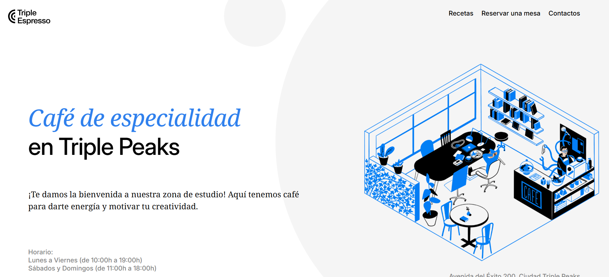
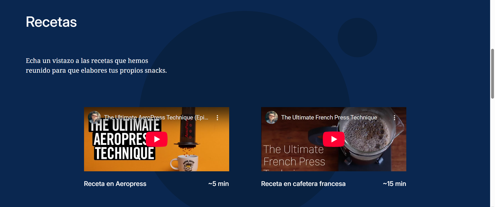
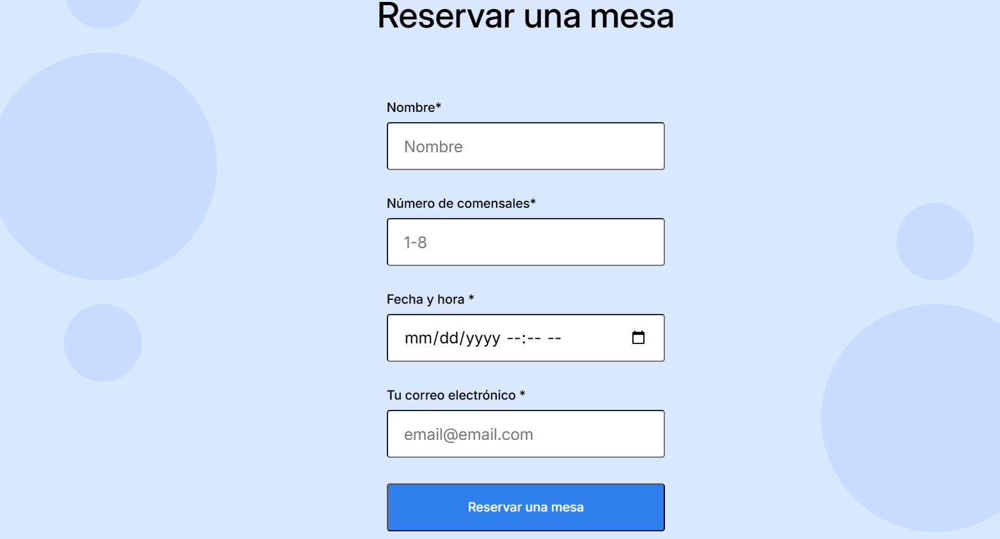
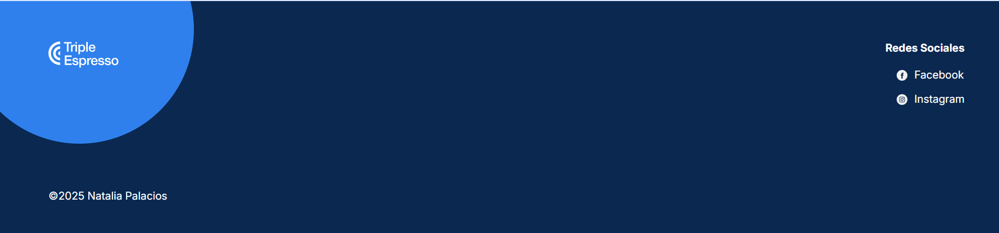

# Triple Espresso
Nombre del proyecto: Cafeteria Triple Espresso

Descripcion del proyecto y su funcionalidad: Esta pagina web esta diseñada para aquellas personas que buscan un espacio para desbordar su creatividad a traves de proyectos o simplemente necesitan de un espacio tranquilo de estudio/trabajo y que ademas son amantes del café. Permite a los usuarios reservar una mesa para deleitar sus paladares con diferentes especialidades de cafe mientras disfrutan de un ambiente tranquilo. Ademas de descubrir nuevas recetas para preparar en casa. 
Dentro de las funcionalidades de la pagina se tiene que:
* Los usuarios pueden realizar reservaciones de 1 a 8 personas por mesa para disfrutar de un ambiente tranquilo y diferentes tipos de cafe.
* Hay una sección dedicada a recetas que combinan diferentes tipos de café con ingredientes especiales.
* Hay un espacio de contacto para ampliar la informacion  de la cafeteria a traves de redes sociales, la direccion donde se encuentra ubicada y los horarios de atencion. 

Descripcion de las teconologias y tecnicas utilizadas:
- Frontend:
  - HTML5
  - CSS3 
  - Git
  - GitHub

